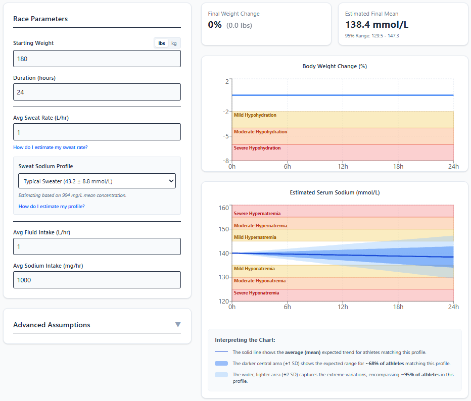

# Endurance Electrolyte Estimator

[](https://j26765883-lab.github.io/endurance-electrolyte-estimator/)

A React application designed to model and estimate physiological trends in hydration and sodium levels for endurance athletes. 

## Overview

This tool uses mathematical mass-balance models to help athletes visualize how their body weight and serum sodium levels might change during endurance events based on their individual parameters (sweat rate, fluid intake, sodium intake, etc.). 



**Disclaimer:** This application is for informational and educational purposes only. It is not intended to provide medical advice, diagnose, treat, cure, or prevent any condition. Always consult with a qualified healthcare professional or sports dietician before making changes to your hydration or nutrition strategies.

## Features

- **Personalized Inputs:** Enter starting weight (lbs/kg), event duration, sweat rate, fluid intake, and sodium intake.
- **Sweat Sodium Profiles:** Choose from normative data profiles (Low-Salt, Typical, Salty) or input custom lab results.
- **Interactive Charts:** Visualize body weight change and estimated serum sodium levels over time using Recharts.
- **Advanced Assumptions:** Fine-tune the model with total body water percentage and baseline serum sodium level.
- **Visual Warnings:** Highlights potential hypohydration, hyponatremia, and hypernatremia risks based on standard thresholds.

## How to Use This Tool

1. **Step 1:** Enter your starting weight and the expected duration of your event.
2. **Step 2:** Estimate your average hourly sweat rate and fluid intake.
3. **Step 3:** Select a sweat sodium profile. If you have not been lab-tested, use the guide below the dropdown to estimate your profile.
4. **Step 4:** Adjust your hourly sodium intake to observe how it affects your estimated serum sodium levels, aiming to keep the trend safely out of the red and orange zones.

## Understanding the Conditions

This tool helps visualize the risks of three main conditions endurance athletes face:
- **Hypohydration (Dehydration):** Occurs when fluid loss exceeds intake. Signs include extreme thirst, dry mouth, dark urine, and fatigue. [Read more on Mayo Clinic](https://www.mayoclinic.org/diseases-conditions/dehydration/symptoms-causes/syc-20354086)
- **Hyponatremia:** A dangerous drop in blood sodium, often caused by overdrinking fluids relative to sodium loss. Signs include nausea, headache, confusion, and muscle cramps. [Read more on Mayo Clinic](https://www.mayoclinic.org/diseases-conditions/hyponatremia/symptoms-causes/syc-20373711)
- **Hypernatremia:** Elevated blood sodium, usually resulting from severe dehydration alongside salt intake. Signs include intense thirst, lethargy, and muscle twitching. [Read more on Cleveland Clinic](https://my.clevelandclinic.org/health/diseases/23164-hypernatremia)

## Recommended Podcasts & Listening

If you're interested in learning more about the science of endurance hydration and fueling, check out these excellent resources:
- **[Science of Ultra](https://www.scienceofultra.com/podcasts):** Hosted by Dr. Shawn Bearden, this is the gold standard for evidence-based information specifically for ultramarathon athletes, with deep dives into physiology, hydration, and nutrition.
- **[The Science of Sport Podcast](https://play.acast.com/s/science-of-sport-podcast):** Hosted by Prof. Ross Tucker and Mike Finch, offering deep dives into sports science myths, including extensive coverage on the history and science of hydration.
- **[KoopCast](https://jasonkoop.com/podcast):** Coach Jason Koop frequently interviews top sports scientists and researchers on ultramarathon fueling, physiology, and hydration strategies.
- **[Fast Talk](https://www.fasttalklabs.com/category/podcasts/):** Features leading physiologists discussing training, nutrition, and hydration for endurance athletes (primarily cycling and running).
- **[Fueling Endurance](https://www.fuelingendurance.com/):** A podcast by sports dietitians focused entirely on how to eat and drink optimally for endurance performance.

## Scientific References

The mathematical models and normative data used in this application are based on the following research:

- **Mathematical Model:** McCubbin, A. J. (2022). Modelling sodium requirements of athletes across a variety of exercise scenarios: Identifying when to test and target, or season to taste. *European Journal of Sport Science*, 23(6), 992-1000.
- **Sweat Profiles:** Lara, B., Gallo-Salazar, C., Puente, C., Areces, F., Salinero, J. J., & Del Coso, J. (2016). Interindividual variability in sweat electrolyte concentration in marathoners. *Journal of the International Society of Sports Nutrition*, 13.
- **Normative Database:** Barnes, K. A., Anderson, M. L., Stofan, J. R., Dalrymple, K. J., Reimel, A. J., Roberts, T. J., ... & Baker, L. B. (2019). Normative data for sweating rate, sweat sodium concentration, and sweat sodium loss in athletes: An update and analysis by sport. *Journal of Sports Sciences*, 37(20), 2356-2366.
- **ACSM Guidelines:** American College of Sports Medicine. (2007). Exercise and fluid replacement position stand. *Medicine & Science in Sports & Exercise*, 39(2), 377-390.

## Technologies Used

- [React](https://reactjs.org/) (v19)
- [Vite](https://vitejs.dev/)
- [Tailwind CSS](https://tailwindcss.com/) (v4)
- [Recharts](https://recharts.org/)

## Getting Started

### Prerequisites

- Node.js (v18 or higher recommended)
- npm

### Installation

1. Clone the repository:
   ```bash
   git clone [https://github.com/j26765883-lab/endurance-electrolyte-estimator.git](https://github.com/j26765883-lab/endurance-electrolyte-estimator.git)
   cd endurance-electrolyte-estimator

2. Install dependencies:
   ```bash
   npm install

3. Start the development server:
   ```bash
   npm run dev

### License
This project is open-source and available under the MIT License.